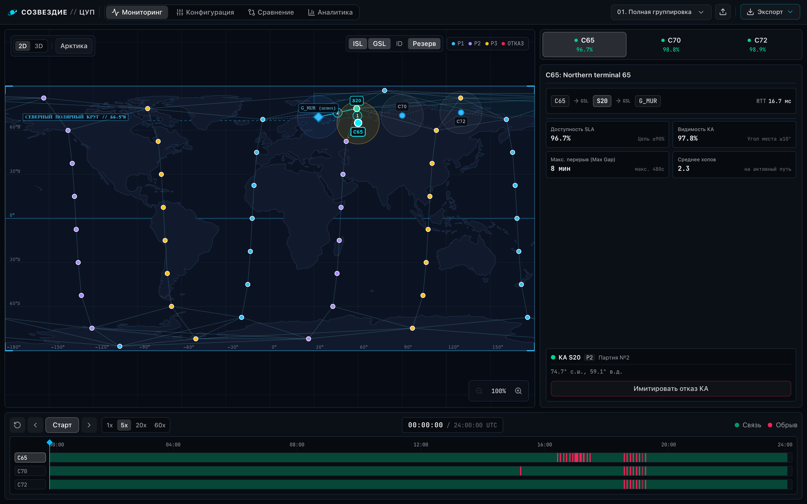
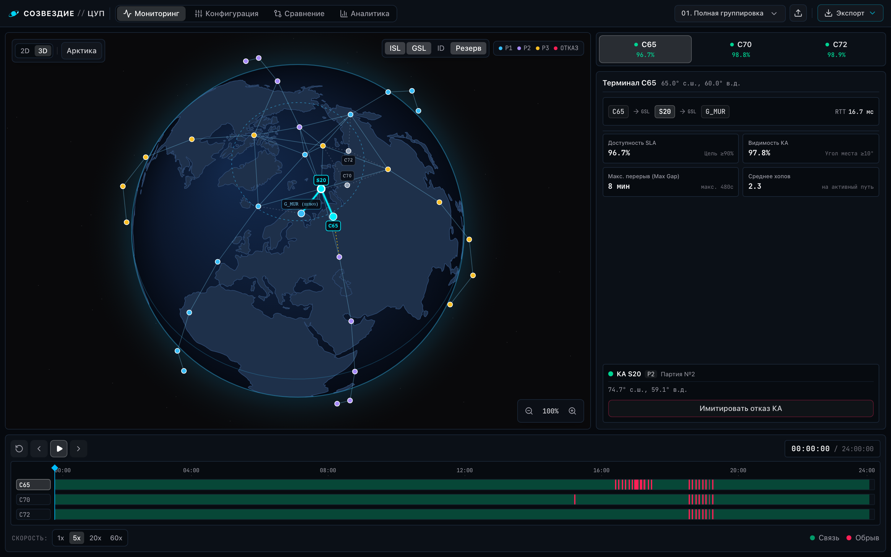
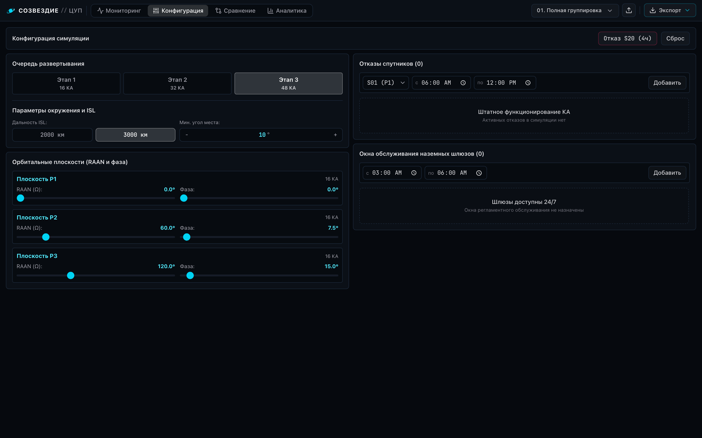
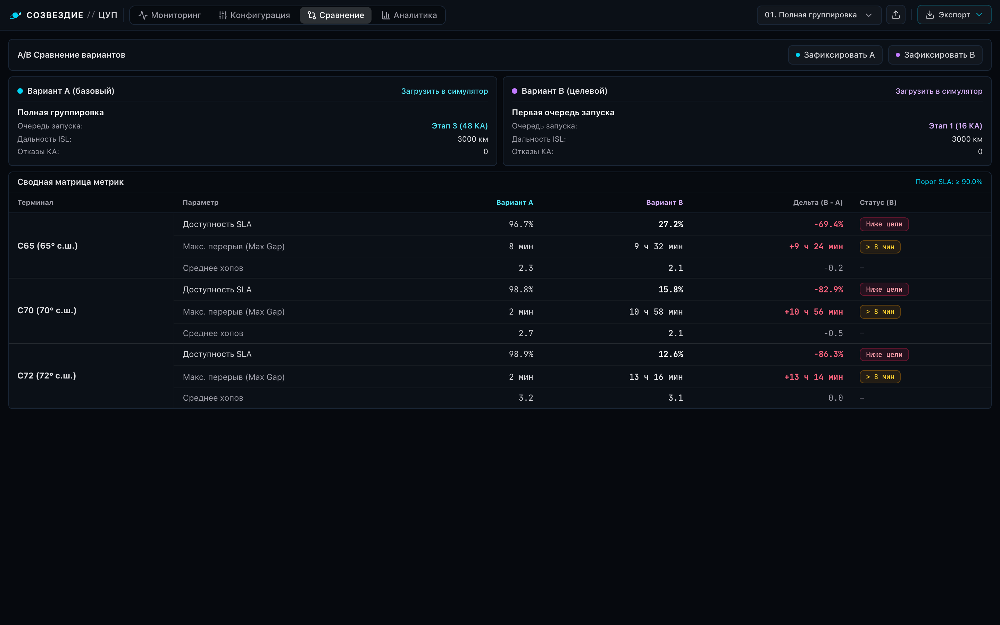
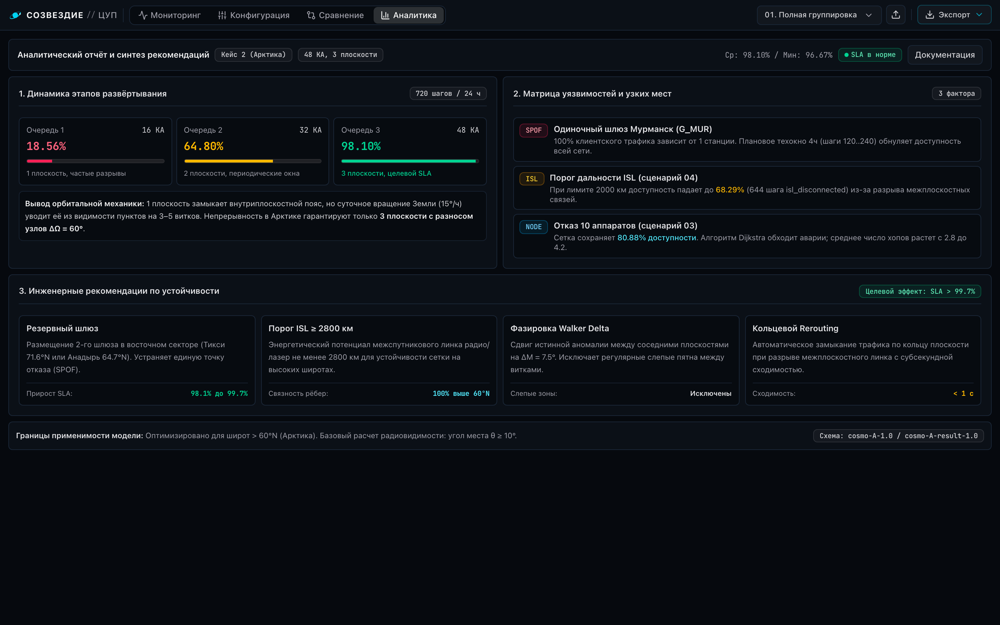

#  Созвездие: ЦУП

Инженерный центр управления спутниковой группировкой и оценки доступности связи в рамках КосмоХакатона 2026.

[**Демо**](https://state3407.space/cosmo/) · [**Зеркало**](https://p4ulbr4dl3y.github.io/cosmo-constellation-sim/)

<p align="center">
  <a href="docs/assets/frontend_verified.png">
    
  </a>
  <a href="docs/assets/globe_3d.png">
    
  </a>
</p>

## Возможности:
- физико-геометрическое ядро: точный расчет положений космических аппаратов на круговой орбите $h=550$ км, наклонение $i=87^\circ$, вращение Земли, межспутниковые линии связи (видимость и дальность), углы возвышения наземных станций ($\ge 10^\circ$);
- маршрутизация и анализ отказов: динамический поиск путей (клиент $\to$ спутники $\to$ шлюз), автоматическая классификация причин разрыва (`no_client_satellite`, `gateway_offline`, `no_gateway_satellite`, `isl_disconnected`);
- интерактивный пункт управления полетами: 2D равнопромежуточная проекция, 3D ортографический глобус, таймлайн со шкалой времени 24 часа и шагом 120 с, диаграмма Ганта доступности по клиентам (C65, C70, C72) с индикацией причин разрыва, интерактивный редактор очередей и поворот плоскостей, а также модуль A/B сравнения сценариев;
- инженерный анализ и рекомендации: аналитическая вкладка с матрицей рисков, технико-экономическим обоснованием и подробным отчетом в [`docs/RECOMMENDATIONS.md`](docs/RECOMMENDATIONS.md);
- стандарты данных и интерфейс командной строки: полная поддержка формата сценариев `cosmo-A-1.0`, экспорт результатов в `cosmo-A-result-1.0`, консольная утилита расчета и валидации без запуска браузера.

<details>
<summary><b>Скриншоты специализированных модулей ЦУП (клик для раскрытия)</b></summary>

#### Конфигурация и моделирование отказов
Управление очередями запуска, углами RAAN и симуляция отказов КА:
<p align="center">
  <a href="docs/assets/config_editor.png">
    
  </a>
</p>

#### A/B Сравнение сценариев
Сравнение доступности, задержек и топологии двух конфигураций созвездия:
<p align="center">
  <a href="docs/assets/ab_comparison.png">
    
  </a>
</p>

#### Инженерная аналитика и матрица рисков
Тепловая карта отказов, распределение причин разрыва и TCO:
<p align="center">
  <a href="docs/assets/analytics_report.png">
    
  </a>
</p>

</details>

---

## Быстрый запуск

### Вариант A. Запуск через Docker Compose (рекомендуемый):
```bash
docker compose up --build -d
```
- веб-интерфейс: `http://localhost:3000`;
- спецификация API (Swagger): `http://localhost:3000/docs`;
- проверка состояния сервиса: `http://localhost:8000/api/health`.

---

### Вариант B. Консольный расчет сценариев
Расчет показателей доступности в терминале с помощью ядра NumPy:
```bash
# Расчет всех эталонных сценариев из 'data/'
cd backend && uv run python -m app.cli --all

# Расчет конкретного сценария с экспортом в cosmo-A-result-1.0
cd backend && uv run python -m app.cli --scenario ../data/01_full_constellation.json --export ../result.json
```

---

### Вариант C. Локальная разработка

#### 1. Бэкенд
Требуется Python 3.13+ и `uv`:
```bash
cd backend
uv sync
uv run uvicorn app.main:app --reload --port 8000
```
API доступен по адресу `http://127.0.0.1:8000` (спецификация Swagger: `http://127.0.0.1:8000/docs`).

Запуск набора тестов:
```bash
cd backend
uv run pytest
```

#### 2. Фронтенд
Требуется Node.js 20+ или Bun:
```bash
cd frontend
npm ci        # или bun install
npm run dev   # или bun run dev
```
Пользовательский интерфейс доступен по адресу `http://localhost:5173`.

---

## Результаты тестов (24 часа, 720 шагов)

| Сценарий | Описание | Доступность связи (средняя) | C65 (65°N) | C70 (70°N) | C72 (72°N) |
|---|---|---|---|---|---|
| `01_full_constellation` | 48 КА, 3 очереди, ISL 3000 км | **98.10%** (цель $\ge 90\%$ достигнута) | 96.67% | 98.75% | 98.89% |
| `02_first_launch` | 1-я очередь (16 КА) | **18.56%** | 27.22% | 15.83% | 12.64% |
| `03_satellite_outages` | Отказ 10 КА с 6-го часа | **80.88%** | 79.31% | 80.83% | 82.50% |
| `04_link_range` | ISL ограничен до 2000 км | **68.29%** | 77.50% | 62.22% | 65.14% |

---

## Стек технологий:
- бэкенд: Python, FastAPI, NumPy, Pydantic, Pytest, Uvicorn, uv;
- фронтенд: React 19, TypeScript, Vite, Tailwind CSS, Lucide, Canvas 2D/3D Globe, Bun.
